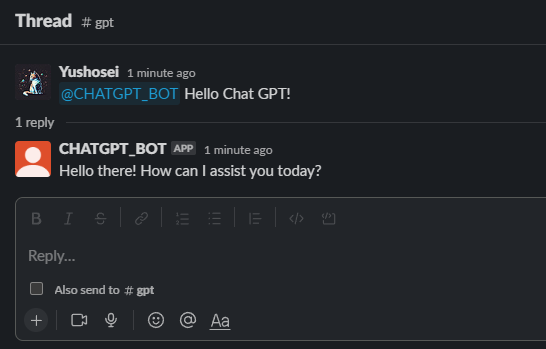

# ktor-chatgpt-slackbot

This project is ktor-based Integrate OpenAI's ChatGPT with in Slack.

## How to Use

### Slack.kt
Change your **API Key** & **Token**

```kotlin
// Socket Token Start With xapp
const val APP_TOKEN = "xapp-"

// Token Start With xoxb (Bot Token)
const val BOT_TOKEN = "xoxb-"

// OpenAI API Key
const val OPENAI_API_KEY = ""
```

### Then start the server
### That's it!

